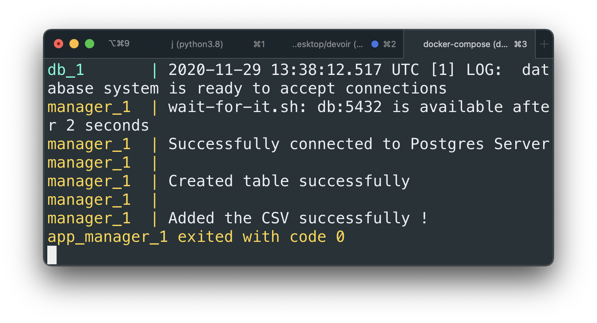

# Last session project.
## Duration: 3h

# Brief description

The python code you see within the manager folder has been designed to connect to a Postgres server, attempt to load a CSV data into a table named *persons* within a given database.

The app isn't containerized yet, we want you to **create a Dockerfile** to **bundle your app along with its dependencies** and a **docker-compose file to orchestrate this app along with a postgres server** using the **official Postgres docker image**.

# Prerequities

1. You **must** have a GitHub account.
2. Fork this repository.
3. Git clone the forked repository into a local repository: `git clone your_forked_repo_https_url`
3. Create a **Dockerfile + docker-compose.yml** file
4. Check if your containerized app works\*
5. Git push\*
6. Post your name, lastname (as appears on the DVO/attendance list) and Github link here: https://forms.gle/qhdQQ2mcgPenCgdb7

\* here is the expected output i should obtain by doing `docker-compose up --build` (you should see one or more "success" lines as you make progress in the project)


\* How to push code,
Do your modifications, and at the end of the 3h session, from your **root project folder**, do from your terminal:
```sh
	git add .
	git commit -m "first commit"
	git push origin master
```
To install git on your [computer](https://git-scm.com/book/fr/v2/Démarrage-rapide-Installation-de-Git)
in [english](https://git-scm.com/book/en/v2/Getting-Started-Installing-Git).

# In English (French below)

## Must Do !
- You can define your dockerfile wherever you want but you **MUST** copy **all the contents** of the directory **manager** in a **dedicated folder** (feel free for the name) within the **root of the container**
- You **MUST** define the **docker-compose.yml** file where it is usually defined, that is, the **project root**.
- The Python code **MUST NOT** be modified, **NOR** moved under **NO** circumstances, **only 1 Dockerfile and 1 docker-compose file should be created**
- I should obtain a result by **ONLY** doing **docker-compose up --build**.
<!-- - You will need, using the docker-compose file, to **tag** the image built from the dockerfile with the exact name: **manager:latest**. -->
- The **service** in the **docker-compose** file, for the application **MUST** be named **manager** 

Anything that does not respect the aforementioned conditions will result in an automatic score of 0 for this exam. This is CRUCIAL so that I can perform the tests on your project.

### Tips
* to run a package: **python -m package_name**
* it is **strongly advised to take a recent version of python image** (> 3.5) and **not** lightweight versions (such as the slim tag therefore), the latest and 3.8.4 tags are operational.
* check if the project requires one or more **dependencies** looking at the code.
* the **dockerfile filename and extension** is left free, however remember to adapt the docker-compose file if the name were to be different from the conventions (eg: mylittledockerfile.dev).
* the python code should wait for the database server to be ready before connecting to it, otherwise, this will result in an error message. Hence you should account for it by writing those 3 lines in your dockerfile:
```
	RUN wget https://raw.githubusercontent.com/vishnubob/wait-for-it/master/wait-for-it.sh -P /
	RUN chmod +x /wait-for-it.sh
	ENTRYPOINT ["/wait-for-it.sh", "db:5432", "--"]
```
For the curious persons, more explanations [here](https://github.com/vishnubob/wait-for-it)
* **environment variables** must be defined in order to **connect to the Postgres server** (user to authenticate, user password, database)
* For the **port and the name of the host to connect to the database**, you can directly find it in the code in the very first functions! **You will have to cleverly use the automatic service discovery feature provided by the docker-compose file** (if you had forgotten already, here [it is](https://docs.docker.com/compose/networking/)...! Again, you **can't** change the **code nor structure** so to be convenient for you.
So look at both how the official Postgres Docker image defines these variable names, and how the code/application logic uses them.
* Don't hesitate to run multiple times using **docker-compose up --build** (often we forget to rebuilt the image when code changes), and check how is your app going on, and then go backwards, modify things that wrent wrong, etc...
* Proceed step-by-step ! We do the dockerfile first, make sure it builds, then we can orchestrate everything with the docker-compose file.
* Don't specify the **TESTING** environment variable, this is for launching my tests on your code.
* Don't hesitate to orchestrate by rebuilding the image ** docker-compose up --build ** and then clean up with a ** docker-compose down ** to make sure everything works from scratch.
And do this before uploading the code to Github, to be sure you don't get a bad grade;)

## French

### Chose à respecter absolument !
- Vous pouvez définir votre dockerfile où vous le souhaitez mais vous **DEVEZ** copier l'ensemble du contenu du directory **manager** dans un dossier **dédié** (nom laissé libre) dans la **racine du conteneur pendant le build process de l'image**
- Vous **DEVEZ** définir le **docker-compose.yml** file là où on le définit usuellement: la **racine du projet**.
- Le code Python **NE** doit être modifié, **NI** déplacé en AUCUN cas, **seuls 1 Dockerfile et 1 docker-compose file comptent.**
<!-- - Vous devrez, en utilisant le docker-compose file, **tagguer** l'image built à partir du dockerfile avec pour nom exact: **manager:latest**.
 -->
- Le **service** dans le **docker-compose** file, pour l'application **DOIT** s'appeler **manager**.

Vous devez respecter toutes les conditions ci-dessus, tout non respect entraînera une note de 0. Ceci est crucial pour que je puisse effectuer les tests sur votre projet.

### Astuces
* pour runner un package: **python -m package_name**
* regardez bien si le projet nécessite une librairie, du côté des **import** statements donc.
* il est vivement **conseillé de prendre une version récente d'image python** (>3.5) et **pas** allégée (pas le tag slim donc), exemple: les tag latest et 3.8.4 sont opérationels.
* le code python doit attendre que le serveur Postgres soit prêt à accepter des connections entrantes avant de s'y connecter, sinon cela entraînera un message d'erreur. Par conséquent, vous devez en tenir compte en écrivant ces 3 lignes dans votre dockerfile:

```
	RUN wget https://raw.githubusercontent.com/vishnubob/wait-for-it/master/wait-for-it.sh -P /
	RUN chmod +x /wait-for-it.sh
	ENTRYPOINT ["/wait-for-it.sh", "db:5432", "--"]
```
Pour les personnes curieuses, plus d'explications [ici](https://github.com/vishnubob/wait-for-it)
* le nom de fichier du dockerfile est laissé libre, pensez bien cependant à adapter le docker-compose file si le nom venait à être différent des conventions (ex: Dockerfile.dev).
* des **variables d'environnement** devront être définies pour pouvoir **se connecter au serveur Postgres** (user à authentifier, mot de passe du user, database)
* idem pour spécifier où se trouve le fichier de data.
* quand au **port et le nom du host**, vous pouvez directement le trouver dans le code dans les toutes premières fonctions ! **Il faudra astucieusement utiliser la fonctionnalité d'automatic service discovery apportée par le docker-compose file** (si vous aviez oublié... https://docs.docker.com/compose/networking/) ! Encore une fois, vous ne pouvez **PAS** modifier le code ni la structure pour vous "arranger".
Pensez donc à regarder à la fois comment **l'image Docker officielle de Postgres** definit ces noms de variables, et  comment le code les utilise.
* Ne spécifiez pas la variable d'environnement **TESTING**, c'est pour lancer mes tests sur votre code.
* faites par étape ! on fait le dockerfile d'abord, on s'assure que ça build, puis on peut alors orchestrer l'ensemble avec le docker-compose file.
* N'hésitez pas à orchestrer en rebuildant l'image **docker-compose up --build** et clean up ensuite avec un **docker-compose down** pour s'assurer que tout fonctionne from scratch. 
Et faites le avant de pusher le code sur Github, pour être sûr que vous n'ayez pas une mauvaise note ! 

<!-- 
### bind mounts exclusions

First of all, docker volumes or bind mounts behave like linux mounts.

If the host volume/mount exists and contains files it will "override" whatever is in the container. If not the container files will be mirrored onto the host volume/mount and the container folder and the host will be in sync. In both cases editing the files on the host will ALWAYS be reflected inside the container.

https://blog.maqpie.com/2017/02/22/fully-automated-development-environment-with-docker-compose/

https://bbengfort.github.io/observations/2017/12/06/psycopg2-transactions.html


tests here are mostly dependent of each other, 
you need to connect to db before doing request
you need to have uploaded a csv to create a table before checking its existence
etc.

"""
runs tkinter/__main__.py, which has this line:

from . import test as main

In this context, . is tkinter, so importing . imports tkinter, which runs tkinter/__init__.py. test is a function defined within that file. So calling main() (next line) has the same effect as running python -m tkinter.__init__ at the command line.


# what's the difference between a server side cursor and client side cursor (apprently you can't use a server side cursor to create a table): https://stackoverflow.com/questions/51804513/psycopg2-syntax-error-at-or-near-update

# dirname gives the last trailing directory in the absolute path defined by __file__
# again dirname will give the 2nd last trailing directory
 -->